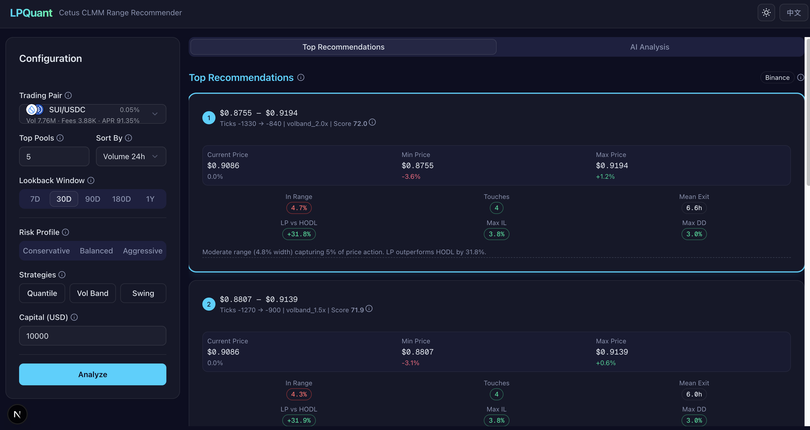
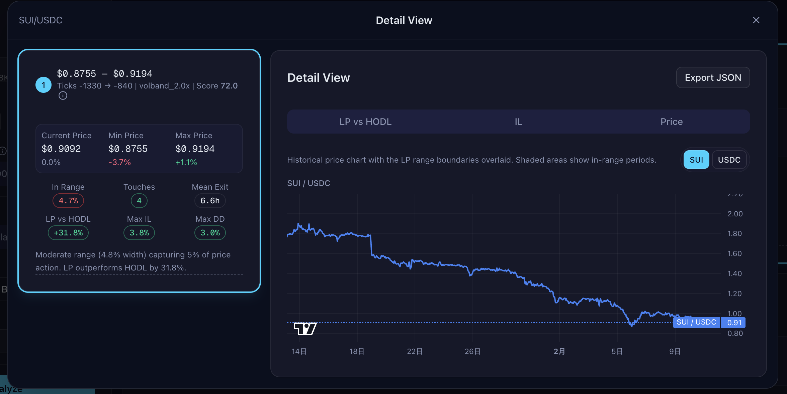
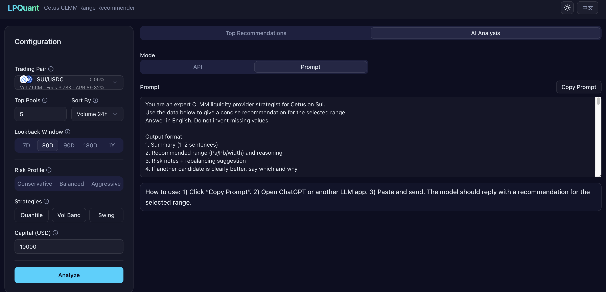

# LPQuant

[English](README.md) | [中文](README.zh.md)

LPQuant is a concentrated‑liquidity range recommendation system for Sui DEX pools.
Built for the **Sui Vibe Hackathon** (Cetus track), it turns historical price behavior into
clear, actionable LP ranges with backtests, charts, and AI‑assisted explanations.

Live demo: [lpquant-web.vercel.app](https://lpquant-web.vercel.app/)

## Highlights

- **Base/Quote normalization** aligned with Cetus display conventions  
  Quote priority: Stablecoins → SUI → BTC → ETH → SOL. Everything in the UI and math
  is derived from this unified Base/Quote view.
- **Top‑range recommendations** with transparent scoring and backtest metrics.
- **Deep‑dive modal**: double‑click a recommendation to open full charts and details.
- **AI Analysis tab**: built‑in LLM prompt & analysis workflow (no vendor lock‑in).
- **Exportable results** in JSON for sharing or audit.

## Screenshots

<!-- Paste your screenshots here (GitHub renders relative image paths). -->





## Architecture

Monorepo with two services connected via a BFF pattern:

```
Browser → Next.js App Router UI
            ↓ (POST /api/recommend)
         Next.js Route Handlers (BFF)
            ↓ parallel fetch
    ┌───────┼───────────┐
    ↓       ↓           ↓
 Birdeye  Sui RPC   Python FastAPI
 /Binance pool cfg   quant engine
 klines
```

- **Frontend** (`apps/web`): Next.js 16, React 19, shadcn/ui, TailwindCSS v4,
  lightweight‑charts v5, next‑intl (en/zh)
- **BFF** (`apps/web/src/app/api/`): Orchestrates kline sources + pool config,
  forwards to the quant engine
- **Quant Engine** (`services/quant`): FastAPI + numpy/pandas — computes metrics,
  scores ranges, returns series for charts

## Price Model & Data Sources

All prices are expressed as **Base / Quote** with a deterministic mapping:

- Quote priority: **Stablecoins → SUI → BTC → ETH → SOL**
- If both sides are the same class (both stable / both outside list), keep coinA/coinB.

Kline (OHLCV) sources:

1. **Birdeye** (primary, if `BIRDEYE_API_KEY` is configured)  
2. **Binance** (fallback, or ratio of USD pairs for non‑stable quotes)

## Development

```bash
# Frontend
cd apps/web && pnpm dev          # Dev server on :3000

# Python Quant Engine
cd services/quant
uv sync && uv run uvicorn app.main:app --reload --port 8000

# Both services must run simultaneously
```

## AI Usage Disclosure (Mandatory)

AI tools were used in planning, implementation, debugging, refactoring, and documentation for this project.

### 1) AI tool names used

- ChatGPT
- Claude Code
- Codex

### 2) Model names / versions

- ChatGPT session model: ChatGPT 5.2 Thinking (used for initial prompt drafting)
- Claude Code session model: Claude Opus 4.6
- Codex session models: GPT-5.3 (`high`, `xhigh`)

### 3) Exact prompts given to AI

- Prompt files in this repository are stored under: `prompts/`
- Baseline project prompts are the files under `prompts/` (including committed revisions)
- Additional iterative prompts were provided through interactive Claude Code and Codex sessions during implementation, review, debugging, and documentation updates
- Redaction policy: secrets and API keys are excluded from prompts; sensitive details may be redacted when needed

## Future Work

- **On‑chain price reconstruction**: index Cetus swap events to build native OHLCV,
  removing external data dependency.
