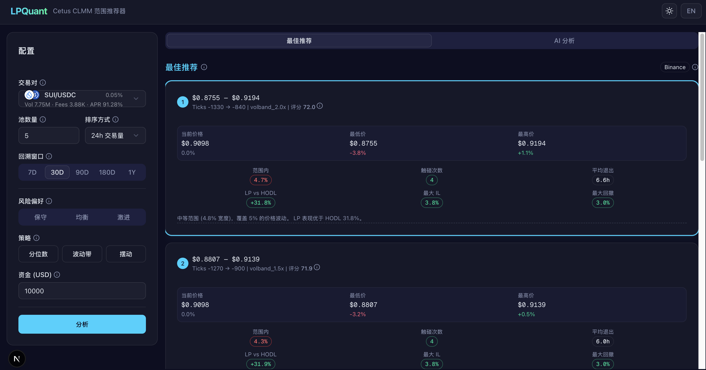
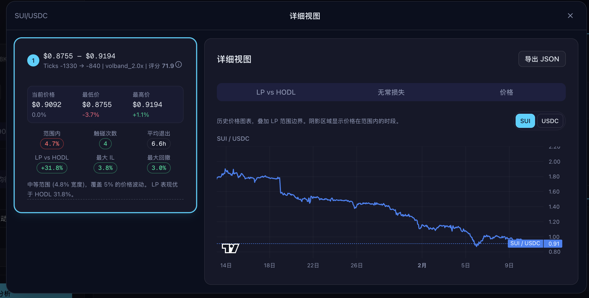
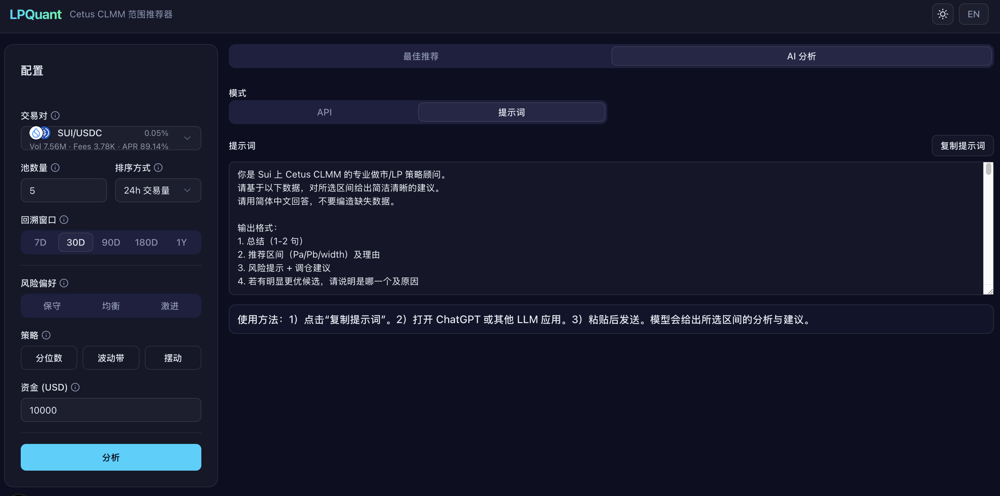

# LPQuant

[English](README.md) | [中文](README.zh.md)

LPQuant 是面向 Sui DEX 池的集中流动性区间推荐系统。
为 **Sui Vibe Hackathon（Cetus 赛道）** 打造，基于历史价格行为给出清晰可执行的
LP 区间建议，并提供回测指标、图表与 AI 辅助解读。

在线演示：[lpquant-web.vercel.app/zh](https://lpquant-web.vercel.app/zh)

## 亮点

- **Base/Quote 统一映射**，与 Cetus 展示习惯一致  
  Quote 优先级：稳定币 → SUI → BTC → ETH → SOL。  
  UI 展示与计算全部基于统一的 Base/Quote 视角。
- **最佳区间推荐**：透明评分 + 回测指标
- **双击弹窗详情**：一键查看完整图表与细节
- **AI 分析 Tab**：内置 LLM 提示词与分析流程（不绑定供应商）
- **可导出 JSON**：便于分享与审计

## 界面截图

<!-- 在此处粘贴你的截图（GitHub 可渲染相对路径图片） -->





## 架构

单仓双服务，BFF 模式：

```
Browser → Next.js App Router UI
            ↓ (POST /api/recommend)
         Next.js Route Handlers (BFF)
            ↓ parallel fetch
    ┌───────┼───────────┐
    ↓       ↓           ↓
 Birdeye  Sui RPC   Python FastAPI
 /Binance pool cfg   quant engine
 klines
```

- **Frontend**（`apps/web`）：Next.js 16、React 19、shadcn/ui、TailwindCSS v4、
  lightweight‑charts v5、next‑intl（中英双语）
- **BFF**（`apps/web/src/app/api/`）：统一 kline + 池子配置并转发给量化引擎
- **Quant Engine**（`services/quant`）：FastAPI + numpy/pandas，输出指标评分与图表序列

## 价格模型与数据源

价格全部以 **Base / Quote** 表达，映射规则固定：

- Quote 优先级：**稳定币 → SUI → BTC → ETH → SOL**
- 若两边同类（如都是稳定币或都不在名单），保持 coinA/coinB 映射

K 线（OHLCV）来源：

1. **Birdeye**（主数据源，配置 `BIRDEYE_API_KEY` 后启用）
2. **Binance**（兜底，或使用 USD 交叉比值构造非稳定币报价）

## 开发

```bash
# 前端
cd apps/web && pnpm dev          # :3000

# Python 量化引擎
cd services/quant
uv sync && uv run uvicorn app.main:app --reload --port 8000

# 两个服务需同时运行
```

## AI 使用披露（强制）

本项目在方案设计、实现、调试、重构和文档编写阶段使用了 AI 工具。

### 1）使用的 AI 工具

- ChatGPT
- Claude Code
- Codex

### 2）模型名称 / 版本

- ChatGPT 会话模型：ChatGPT 5.2 Thinking（用于初始提示词草拟）
- Claude Code 会话模型：Claude Opus 4.6
- Codex 会话模型：GPT-5.3（`high`、`xhigh`）

### 3）提供给 AI 的提示词（Exact Prompts）

- 仓库内提示词文件路径：`prompts/`
- 项目基线提示词为 `prompts/` 目录下的文件（含已提交的版本迭代）
- 另有一部分迭代式提示词来自 Claude Code 与 Codex 的交互式开发会话（实现、评审、调试、文档更新等阶段）
- 脱敏策略：提示词不包含密钥/API Key，必要时会对敏感细节做脱敏处理

## 后续计划

- **链上价格重建**：基于 Cetus swap 事件重建 OHLCV，降低外部依赖。
